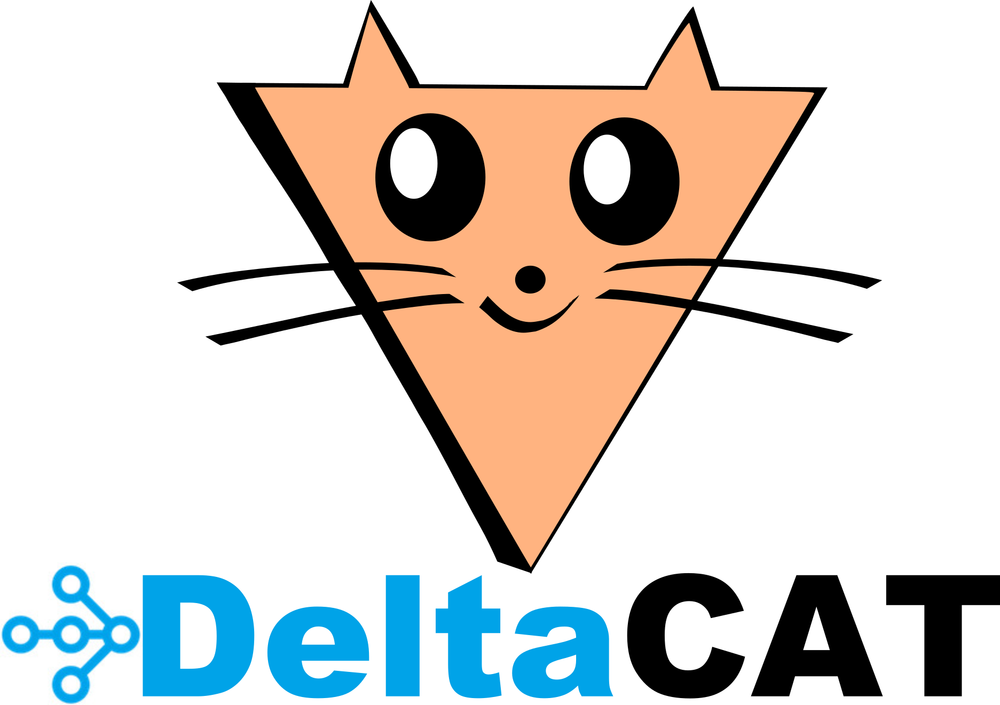

DeltaCAT is a portable Multimodal Data Lakehouse powered by [Ray](https://github.com/ray-project/ray). It lets you define and manage
fast, scalable, ACID-compliant Multimodal data lakes, and has been used to [successfully manage exabyte-scale enterprise
data lakes](https://aws.amazon.com/blogs/opensource/amazons-exabyte-scale-migration-from-apache-spark-to-ray-on-amazon-ec2/).

It uses the Ray distributed compute framework together with [Apache Arrow](https://github.com/apache/arrow) and
[Daft](https://github.com/Eventual-Inc/Daft) to efficiently scale common table management tasks, like petabyte-scale
merge-on-read and copy-on-write operations.

DeltaCAT provides four high-level components:
1. **Catalog**: High-level APIs to create, discover, organize, and manage datasets.
2. **Compute**: Distributed data management jobs to read, write, and optimize datasets.
3. **Storage**: In-memory and on-disk multi-modal dataset formats.
4. **Sync**: Synchronize DeltaCAT datasets with other data warehouses and table formats.

## Getting Started

DeltaCAT is rapidly evolving. Usage instructions will be posted here soon!

For now, feel free to peruse some of our examples:
* https://github.com/ray-project/deltacat/tree/2.0/deltacat/examples/rivulet
* https://github.com/ray-project/deltacat/tree/2.0/deltacat/examples/iceberg
