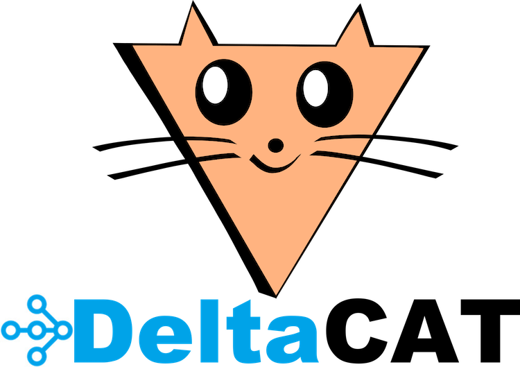
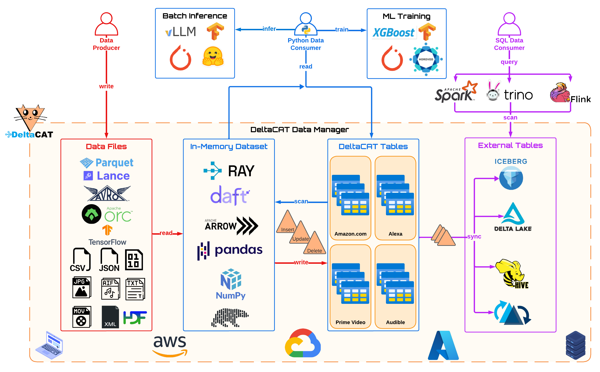

<p align="center">
  
</p>

DeltaCAT is a portable Pythonic Data Lakehouse powered by [Ray](https://github.com/ray-project/ray). It lets you define and manage
fast, scalable, ACID-compliant multimodal data lakes, and has been used to [successfully manage exabyte-scale enterprise
data lakes](https://aws.amazon.com/blogs/opensource/amazons-exabyte-scale-migration-from-apache-spark-to-ray-on-amazon-ec2/).

It uses the Ray distributed compute framework together with [Apache Arrow](https://github.com/apache/arrow) and
[Daft](https://github.com/Eventual-Inc/Daft) to efficiently scale common table management tasks, like petabyte-scale
merge-on-read and copy-on-write operations.

DeltaCAT provides the following high-level components:
1. [**Catalog**](deltacat/catalog/interface.py): High-level APIs to create, discover, organize, share, and manage datasets.
2. [**Compute**](deltacat/compute/): Distributed data management procedures to read, write, and optimize datasets.
3. [**Storage**](deltacat/storage/): In-memory and on-disk multimodal dataset formats.
4. **Sync** (in development): Synchronize DeltaCAT datasets to data warehouses and other table formats.

## Overview
DeltaCAT's **Catalog**, **Compute**, and **Storage** layers work together to bring ACID-compliant data management to any Ray application. These components automate data indexing, change management, dataset read/write optimization, schema evolution, and other common data management tasks across any set of data files readable by Ray Data, Daft, Pandas, Polars, PyArrow, or NumPy.

<p align="center">
  
</p>

Data consumers that prefer to stay within the ecosystem of Pythonic data management tools can use DeltaCAT's native table format to manage their data with minimal overhead. For integration with other data analytics frameworks (e.g., Apache Spark, Trino, Apache Flink), DeltaCAT's **Sync** component offers zero-copy synchronization of your tables to Apache Iceberg and other table formats.

## Getting Started
DeltaCAT applications run anywhere that Ray runs, including your local laptop, cloud computing clusters, or on-premise clusters.

DeltaCAT lets you manage **Tables** across one or more **Catalogs**. A **Table** can be thought of as a named collection of one or more data files. A **Catalog** provides a root location (e.g., a local file path or S3 Bucket) to store table information, and can be rooted in any [PyArrow-compatible Filesystem](https://arrow.apache.org/docs/python/filesystems.html). **Tables** can be created, read, and written using the `dc.write` and `dc.read` APIs.

### Quick Start

```python
import deltacat as dc
import pandas as pd

# Initialize DeltaCAT with a local catalog.
# Ray will be initialized automatically.
# Catalog files will be stored in .deltacat/ in the current working directory.
dc.init(catalogs={"my_catalog": dc.Catalog()})

# Create data to write.
data = pd.DataFrame({
    "id": [1, 2, 3],
    "name": ["Alice", "Bob", "Charlie"],
    "age": [25, 30, 35]
})

# Write data to a table.
# Table creation is handled automatically.
dc.write(data, "users")

# Read the data back as a Daft DataFrame.
# Daft lazily and automatically distributes data across your Ray cluster.
daft_df = dc.read("users")  # Returns Daft DataFrame (default)
daft_df.show()  # Materialize and print the DataFrame

# Append more data and add a new column.
# Compaction and zero-copy schema evolution are handled automatically.
data = pd.DataFrame({
    "id": [4, 5, 6],
    "name": ["Diana", "Ethan", "Fiona"],
    "age": [40, 45, 50],
    "city": ["New York", "Los Angeles", "Chicago"]
})
dc.write(data, "users")

# Read the full table back into a Daft DataFrame.
daft_df = dc.read("users")
daft_df.select("name", "city").show()  # Just print the names and cities
```

### Organizing Tables with Namespaces

In DeltaCAT, table **Namespaces** are optional but useful for organizing related tables within a catalog:

```python
import deltacat as dc
import pandas as pd

# Initialize DeltaCAT with a local catalog
dc.init(catalogs={"my_catalog": dc.Catalog()})

# Create some sample data for different business domains
user_data = pd.DataFrame({
    "user_id": [1, 2, 3],
    "name": ["Alice", "Bob", "Charlie"],
    "email": ["alice@example.com", "bob@example.com", "charlie@example.com"]
})

product_data = pd.DataFrame({
    "product_id": [101, 102, 103],
    "name": ["Widget", "Gadget", "Tool"],
    "price": [19.99, 29.99, 39.99]
})

order_data = pd.DataFrame({
    "order_id": [1001, 1002, 1003],
    "user_id": [1, 2, 1],
    "product_id": [101, 102, 103],
    "quantity": [2, 1, 1]
})

# Write tables to different namespaces to organize them by domain
dc.write(user_data, "users", namespace="identity")
dc.write(product_data, "catalog", namespace="inventory")
dc.write(order_data, "transactions", namespace="sales")

# Read from specific namespaces
users_df = dc.read("users", namespace="identity", read_as=dc.DatasetType.PANDAS)
products_df = dc.read("catalog", namespace="inventory", read_as=dc.DatasetType.PANDAS)
orders_df = dc.read("transactions", namespace="sales", read_as=dc.DatasetType.PANDAS)

print(f"Identity namespace has {len(users_df)} users")
print(f"Inventory namespace has {len(products_df)} products")
print(f"Sales namespace has {len(orders_df)} transactions")

# Tables with the same name can exist in different namespaces
# Create separate marketing and finance views of the same data
marketing_users = pd.DataFrame({
    "user_id": [1, 2, 3],
    "segment": ["premium", "standard", "premium"],
    "acquisition_channel": ["social", "search", "referral"]
})

finance_users = pd.DataFrame({
    "user_id": [1, 2, 3],
    "lifetime_value": [299.99, 149.99, 399.99],
    "payment_method": ["credit", "paypal", "credit"]
})

dc.write(marketing_users, "users", namespace="marketing")
dc.write(finance_users, "users", namespace="finance")

# Each namespace maintains its own "users" table with different schemas
marketing_df = dc.read("users", namespace="marketing", read_as=dc.DatasetType.PANDAS)
finance_df = dc.read("users", namespace="finance", read_as=dc.DatasetType.PANDAS)

print(f"Marketing users table has columns: {list(marketing_df.columns)}")
print(f"Finance users table has columns: {list(finance_df.columns)}")
```

### Supported Dataset and File Formats
DeltaCAT natively supports a variety of open dataset and file formats already integrated with Ray and Arrow. You can use `dc.read` to read tables back as a Daft DataFrame, Ray Dataset, Pandas DataFrame, PyArrow Table, Polars DataFrame, NumPy Array, or list of PyArrow ParquetFile objects:

```python
# Read directly into eagerly materialized local datasets:
pandas_df = dc.read("users", read_as=dc.DatasetType.PANDAS)  # Returns Pandas DataFrame
pyarrow_table = dc.read("users", read_as=dc.DatasetType.PYARROW)  # Returns PyArrow Table
polars_df = dc.read("users", read_as=dc.DatasetType.POLARS)  # Returns Polars DataFrame
numpy_array = dc.read("users", read_as=dc.DatasetType.NUMPY)  # Returns NumPy Array

# Or into a lazily materialized list of PyArrow ParquetFile objects:
pyarrow_pq_files = dc.read("users", read_as=dc.DatasetType.PYARROW_PARQUET)  # Returns List[ParquetFile]

# Or as distributed datasets (for larger data):
daft_df = dc.read("users", read_as=dc.DatasetType.DAFT)  # Returns Daft DataFrame (Default)
ray_dataset = dc.read("users", read_as=dc.DatasetType.RAY_DATASET)  # Returns Ray Dataset
```

 `dc.write` can also write any of these dataset types:

```python
import pyarrow as pa

# Create a pyarrow table to write.
data = pa.Table.from_pydict({
    "id": [1, 2, 3],
    "name": ["Alice", "Bob", "Charlie"],
    "age": [25, 30, 35]
})

# Write different dataset types to the default table file format (Parquet):
daft_df = dc.from_pyarrow(data, dc.DatasetType.DAFT)  # Convert to Daft DataFrame
dc.write(daft_df, "my_daft_table")

ray_dataset = dc.from_pyarrow(data, dc.DatasetType.RAY_DATASET)  # Convert to Ray Dataset
dc.write(ray_dataset, "my_ray_dataset")

pandas_df = dc.from_pyarrow(data, dc.DatasetType.PANDAS)  # Convert to Pandas DataFrame
dc.write(pandas_df, "my_pandas_table")

pyarrow_table = dc.from_pyarrow(data, dc.DatasetType.PYARROW)  # Convert to PyArrow Table
dc.write(pyarrow_table, "my_pyarrow_table")

polars_df = dc.from_pyarrow(data, dc.DatasetType.POLARS)  # Convert to Polars DataFrame
dc.write(polars_df, "my_polars_table")

numpy_array = dc.from_pyarrow(data, dc.DatasetType.NUMPY)  # Convert to NumPy Array
dc.write(numpy_array, "my_numpy_table")
```

Or write to different table file formats:

```python
# Start by writing to a new table with a custom list of supported readers.
# By default, DeltaCAT will raise an error if we attempt to write data to
# a file format that can't be read by one or more dataset types.
content_types_to_write = {
    dc.ContentType.PARQUET,
    dc.ContentType.AVRO,
    dc.ContentType.ORC,
    dc.ContentType.FEATHER,
}
supported_reader_types = [
    reader_type for reader_type in dc.DatasetType
    if content_types_to_write & reader_type.readable_content_types
]
dc.write(
    data,
    "my_mixed_format_table",
    content_type=dc.ContentType.PARQUET, # Write Parquet (Default)
    table_properties={dc.TableProperty.SUPPORTED_READER_TYPES: supported_reader_types}
)

# Now apppend the same data using our remaining target file formats:
dc.write(data, "my_mixed_format_table", content_type=dc.ContentType.AVRO)
dc.write(data, "my_mixed_format_table", content_type=dc.ContentType.ORC)
dc.write(data, "my_mixed_format_table", content_type=dc.ContentType.FEATHER)

# All file formats will be automatically unified at read time with the contents
# of 'data' repeated 4 times - one for each file format we appended it to.
pandas_df = dc.read("my_mixed_format_table", read_as=dc.DatasetType.PANDAS)
pandas_df.show()
```

### Multi-Table Transactions

DeltaCAT transactions can span multiple tables and namespaces. Since all operations within a transaction either succeed or fail together, this makes it easier to keep related datasets consistent across your entire catalog.

```python
import deltacat as dc
import pandas as pd

# Sample data for a multi-table transaction
products_data = pd.DataFrame({
    "product_id": [1, 2, 3, 4],
    "name": ["Widget", "Gadget", "Tool", "Device"],
    "price": [10.99, 25.50, 15.75, 99.99],
    "category": ["electronics", "electronics", "tools", "electronics"],
})

sales_data = pd.DataFrame({
    "sale_id": [1001, 1002, 1003, 1004, 1005],
    "product_id": [1, 2, 1, 3, 4],
    "quantity": [2, 1, 1, 3, 1],
    "sale_date": ["2024-01-01", "2024-01-01", "2024-01-02", "2024-01-02", "2024-01-03"],
})

# Execute multiple table operations within a single transaction
with dc.transaction():
    # Create products table
    dc.write(products_data, "products")

    # Create sales table
    dc.write(sales_data, "sales")

    # Read products data to create a derived table
    products_df = dc.read("products", read_as=dc.DatasetType.PANDAS)

    # Create a derived summary table (electronics products only)
    electronics_df = products_df[products_df["category"] == "electronics"]
    electronics_summary = pd.DataFrame({
        "category": ["electronics"],
        "product_count": [len(electronics_df)],
        "avg_price": [electronics_df["price"].mean()],
        "total_value": [electronics_df["price"].sum()],
    })

    # Write derived table
    dc.write(electronics_summary, "category_summary")

# All tables are now created atomically
# If any operation had failed, none of the tables would exist
print("Transaction completed successfully!")
print(f"Products table exists: {dc.table_exists('products')}")
print(f"Sales table exists: {dc.table_exists('sales')}")
print(f"Summary table exists: {dc.table_exists('category_summary')}")
```

### Working with Multiple Catalogs

DeltaCAT lets you work with multiple catalogs in a single application. All catalogs registered with DeltaCAT are tracked by a Ray Actor to make them automatically available to all workers in your cluster or local machine.

For example, you may want to test a write against a local staging catalog before committing it to a shared production catalog:

```python
import deltacat as dc
import pandas as pd
import pyarrow as pa
from decimal import Decimal

# Initialize catalogs with separate names and catalog roots.
dc.init(catalogs={
    "staging": dc.Catalog(config=dc.CatalogProperties(
        root="/tmp/staging/",
        filesystem=pa.fs.LocalFileSystem()
    )),
    "prod": dc.Catalog(config=dc.CatalogProperties(
        root="s3://deltacat_prod/",
        filesystem=pa.fs.S3FileSystem()
    ))
})

# Create a PyArrow table with decimal256 data
decimal_table = pa.table({
    "item_id": [1, 2, 3],
    "price": pa.array([
        Decimal("999.99"),
        Decimal("1234.56"),
        Decimal("567.89")
    ], type=pa.decimal256(10, 2))
})

# Try to write decimal256 data to the staging table.
# DeltaCAT auto-detects that decimal256 isn't readable
# by several default supported table reader types
# (Polars, Daft, Ray Data) and raises a TableValidationError.
try:
    dc.write(decimal_table, "financial_data", catalog="staging")
    print("Decimal256 write succeeded")
except dc.TableValidationError as e:
    print(f"Validation error: {e}")
    print("Decimal256 may break existing data consumers in prod, trying decimal128...")

    # Cast the price column from decimal256 to decimal128
    decimal_table = decimal_table.set_column(
        decimal_table.schema.get_field_index("price"),
        "price",
        pa.cast(decimal_table["price"], pa.decimal128(10, 2))
    )

# Write decimal128 data to staging and ensure that the write succeeds
dc.write(decimal_table, "financial_data", catalog="staging")

# Read from staging to verify
staging_data = dc.read("financial_data", catalog="staging", read_as=dc.DatasetType.PANDAS)
assert staging_data["price"].tolist() == [Decimal("999.99"), Decimal("1234.56"), Decimal("567.89")]

# Now write the validated data to production
dc.write(decimal_table, "financial_data", catalog="prod")
```

For more information, see the DeltaCAT [Schema](deltacat/docs/schema/README.md) and [Table](deltacat/docs/table/README.md) documentation.

### Time Travel

DeltaCAT supports time travel queries that let you read table data as it existed at any point in the past:

```python
import deltacat as dc
import pandas as pd
import time

# Initialize DeltaCAT with a local catalog
dc.init(catalogs={"my_catalog": dc.Catalog()})

# Create initial user data
initial_users = pd.DataFrame({
    "user_id": [1, 2, 3],
    "name": ["Alice", "Bob", "Charlie"],
    "status": ["active", "active", "inactive"]
})

dc.write(initial_users, "users")

# Capture timestamp for time travel
time.sleep(1)
checkpoint_time = time.time_ns()

# Later, update the data - promote Bob and add new users
updated_users = pd.DataFrame({
    "user_id": [1, 2, 3, 4, 5],
    "name": ["Alice", "Bob", "Charlie", "Diana", "Ethan"],
    "status": ["active", "premium", "active", "active", "inactive"]
})

dc.write(updated_users, "users", mode=dc.TableWriteMode.REPLACE)

# Compare current state vs historic state
current_data = dc.read("users", read_as=dc.DatasetType.PANDAS)
assert len(current_data) == 5  # Now have 5 users

# Time travel: query data as it existed at the checkpoint
with dc.transaction(as_of=checkpoint_time):
    historic_data = dc.read("users", read_as=dc.DatasetType.PANDAS)

    # Validate historic state
    assert len(historic_data) == 3  # Originally had 3 users
    assert historic_data[historic_data["user_id"] == 2]["status"].iloc[0] == "active"  # Bob was active, not premium
    assert not any(historic_data["user_id"] == 4)  # Diana didn't exist yet
```

## Runtime Environment Requirements

DeltaCAT's transaction system assumes that the host machine provides strong system clock accuracy guarantees, and that the filesystem hosting the catalog root directory offers strong consistency.

Taken together, these requirements make DeltaCAT suitable for production use on most major cloud computing hosts (e.g., EC2, GCE, Azure VMs) and storage systems (e.g., S3, GCS, Azure Blob Storage), but local laptops should typically be limited to testing/experimental purposes.

## Additional Resources
### Table Documentation

The [Table](deltacat/docs/table/README.md) documentation provides a more comprehensive overview of DeltaCAT's table management APIs, including how to create, read, write, and manage tables.

### Schema Documentation

The [Schema](deltacat/docs/schema/README.md) documentation provides a more comprehensive overview of DeltaCAT's schema management APIs, supported data types, file formats, and data consistency guarantees.

### Examples

The [DeltaCAT Examples](deltacat/examples/) show how to build more advanced application like external data source indexers and custom dataset compactors. They also demonstrate some experimental Apache Iceberg and Beam integrations.

### DeltaCAT URLs and Filesystem APIs
The [DeltaCAT API Tests](deltacat/tests/test_deltacat_api.py) provide examples of how to efficiently explore, clone, and manipulate DeltaCAT catalogs by using DeltaCAT URLs together with filesystem-like list/copy/get/put APIs.

### DeltaCAT Catalog APIs
The [Default Catalog Tests](deltacat/tests/catalog/test_default_catalog_impl.py) provide more exhaustive examples of DeltaCAT **Catalog** API behavior.
